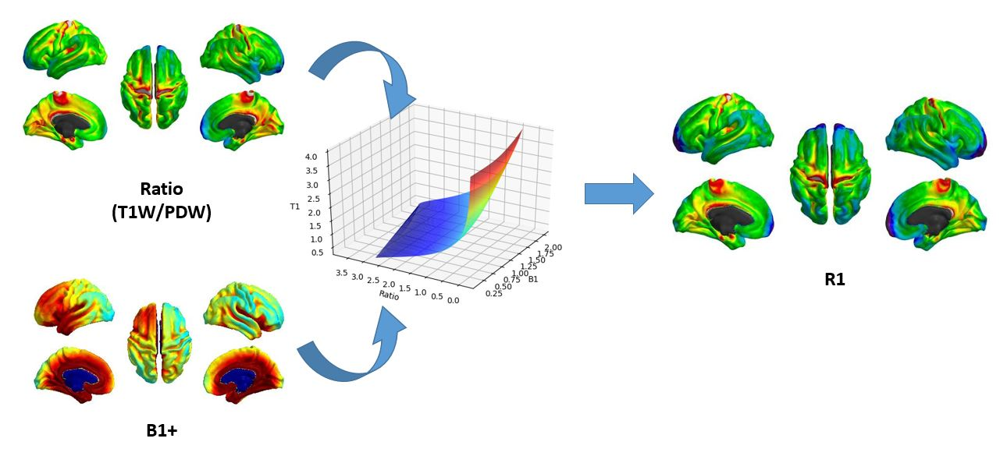
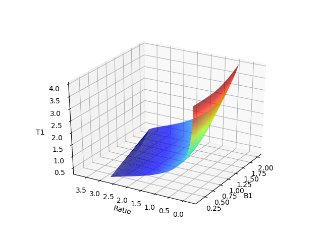
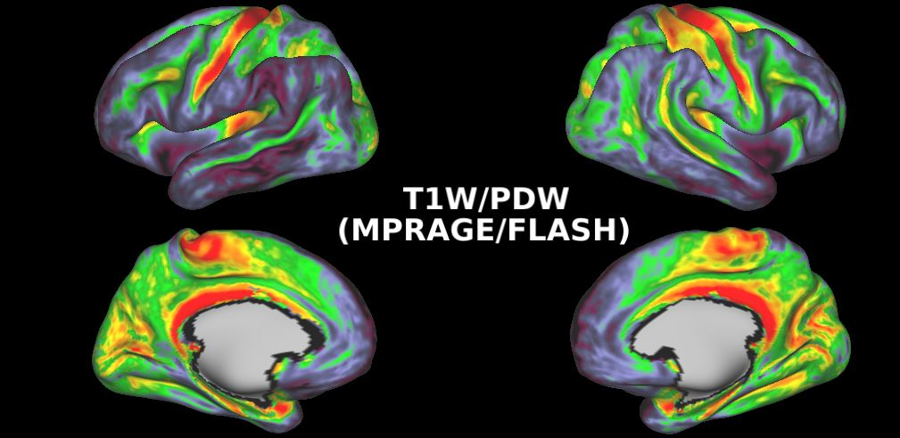
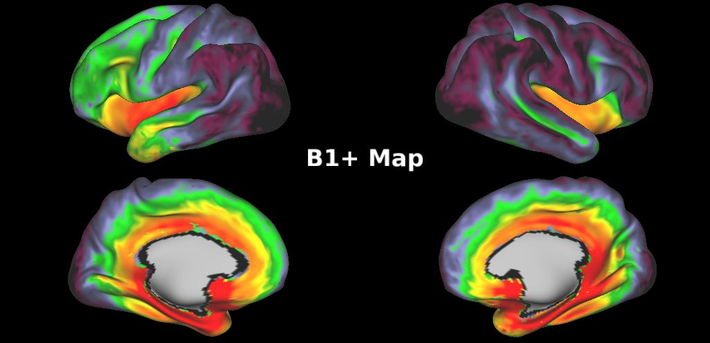
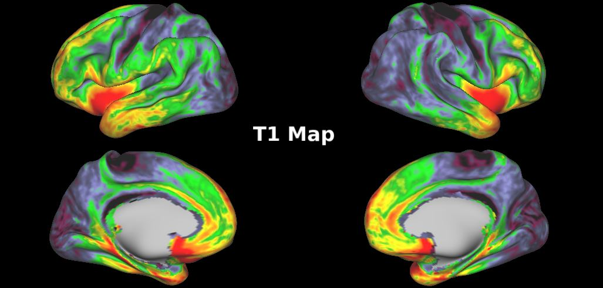
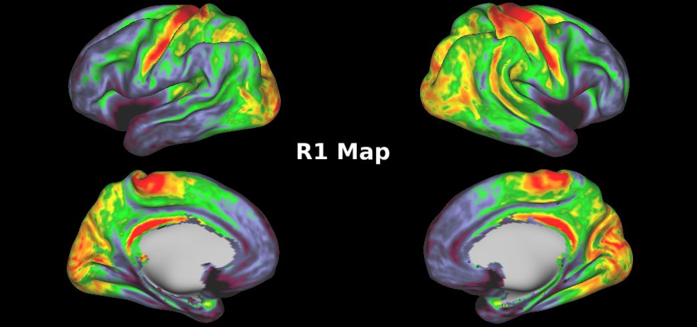

# R1 (1/T1) mapping using MPRAGE and FLASH images and a lookup table



## Overview

Excellent explanation of dictionary based methods by Mathieu Boudreau: <https://qmrlab.org/2019/04/08/T1-mapping-mp2rage.html>

Based on this paper: [Optimizing T1-weighted imaging of cortical myelin content at 3.0 T. Bock et. al, (2013) Neuroimage.](https://www.sciencedirect.com/science/article/pii/S1053811912009615)
Using a T1W-MPRAGE (IR-GRE sequence), PDW-FLASH (GRE sequence) and B1+ map, we can estimate values of T1 using signal equations. equations.py has the MPRAGE signal equation based on this paper: [Optimizing the magnetization-prepared rapid gradient-echo (MP-RAGE) sequence. Wang et. al (2014) PLoS One.](https://journals.plos.org/plosone/article?id=10.1371/journal.pone.0096899) The same equation also appears in this paper: [Development and validation of a new MRI simulation technique that can reliably estimate optimal in vivo scanning parameters in a glioblastoma murine model. Protti et. al, (2018) PloS one,](https://journals.plos.org/plosone/article?id=10.1371/journal.pone.0200611) in which the authors also provide a C++ implementation of signal equation simulations. equations.py also has steady state flash equation. MPRAGE_FLASH_lookup.py uses these equations to create a lookup table of values of T1 for values of MPRAGE/FLASH ratio, including deviations in the flip angle caused by B1+. sample_R1_map.py uses scipy's griddata to interpolate this lookup table and find values of T1 given values of the MPRAGE/FLASH ratio and a B1 map.

## Using the code
To generate a lookup table, copy equations.py and MPRAGE_FLASH_lookup.py to your working directory. To read in nifti or gifti data and pass it through the table, you need something like nibael.

Prereqs:
```
# Make sure you have numpy
import numpy as np
# For plotting:
import matplotlib.pyplot as plt
from mpl_toolkits.mplot3d import Axes3D
# pandas to read and write to csv
import pandas as pd
from MPRAGE_FLASH_lookup import generate_lookup
```
Generating the table, this takes about 5 minutes. The arguments are sequence parameters for the T1W and PDW images: TI, ES, TD, alpha, pe1, enc_scheme, ES_PD, alpha_PD, pe1_PD
```
T1_lookup = generate_lookup(1,0.007916,1.1,12,100,
  'centric',0.007916,4,180)
```
Plotting the table:
```
fig = plt.figure()
ax = fig.gca(projection='3d')
ax.plot_trisurf(T1_lookup[:, 1], T1_lookup[:, 2], T1_lookup[:, 0], cmap=plt.cm.jet, linewidth=0.2, antialiased=True)
ax.set_xlabel('B1')
ax.set_ylabel('Ratio')
ax.set_zlabel('T1')
ax.view_init(azim=210)
plt.show()

# Also can save to CSV if you don't want to lose it
lookup_df = pd.DataFrame(T1_lookup, columns=["T1","B1err","Ratio"])
lookup_df.to_csv("T1_Lookup_Table.csv")

```


To make the sampling finer or coarser, you can go into MPRAGE_FLASH_lookup.py and change the step-size or range of T1 and B1 values.
If you have freesurfer run, and map your data onto the surface following HCP pipelines, you can view you data using connectome-workbench:

 


Now we can look up ratio image intensities and apply B1+ correction to them. We can use this surface data as input into the lookup table:

```
# Import gifti data using nibabel
import nibabel as nib
import os

# Loop through and get all ratio surface data
path=r'C:\Users\laagi_000\Documents\Laagi\New folder\Sample'
input_dirs=next(os.walk(path))[1]
lh_ratios = np.zeros(shape=(len(input_dirs),32492))
rh_ratios = np.zeros(shape=(len(input_dirs),32492))
for x in range(0,len(input_dirs)):
    subj = input_dirs[x]
    lh_path = '{0}\\{1}\\32k\\lh.MyelinMap.32k_fs_LR.func.gii'.format(path,subj)
    rh_path = '{0}\\{1}\\32k\\rh.MyelinMap.32k_fs_LR.func.gii'.format(path, subj)
    lh_ratio = nib.load(lh_path)
    rh_ratio = nib.load(rh_path)
    lh_ratios[x,:] = lh_ratio.darrays[0].data
    rh_ratios[x,:] = rh_ratio.darrays[0].data

#Loop again for B1 maps.
path=r'C:\Users\laagi_000\Documents\Laagi\New folder\Sample'
input_dirs=next(os.walk(path))[1]
lh_b1s = np.zeros(shape=(len(input_dirs),32492))
rh_b1s = np.zeros(shape=(len(input_dirs),32492))
for x in range(0,len(input_dirs)):
    subj = input_dirs[x]
    lh_path = '{0}\\{1}\\32k\\lh.B1.32k_fs_LR.func.gii'.format(path,subj)
    rh_path = '{0}\\{1}\\32k\\rh.B1.32k_fs_LR.func.gii'.format(path, subj)
    lh_b1 = nib.load(lh_path)
    rh_b1 = nib.load(rh_path)
    lh_b1s[x,:] = lh_b1.darrays[0].data/150
    rh_b1s[x,:] = lh_b1.darrays[0].data/150

```

Now we can use our lookup table and find values of T1 for every ratio and B1+.

```
from scipy import interpolate
T1_Lookup = pd.read_csv("T1_Lookup_Table.csv", usecols=["B1err","ratio","T1"])
#Interpolate with griddata
lh_t1 = interpolate.griddata(np.array([T1_Lookup["B1err"],T1_Lookup["Ratio"]]).T,
                          T1_Lookup["T1"],
                          (lh_b1s.flatten()/160,lh_ratios.flatten()))

rh_t1 = interpolate.griddata(np.array([T1_Lookup["B1err"],T1_Lookup["Ratio"]]).T,
                          T1_Lookup["T1"],
                          (rh_b1s.flatten()/160,rh_ratios.flatten()))

#Reshape back into original:

lh_t1s = lh_r1.reshape(10,32492)
rh_t1s = rh_r1.reshape(10,32492)

lh_r1s = 1/lh_t1s
rh_t1s = 1/lh_t1s

#Mean and export to gifti, using template of imported gifti: Basically Changing a random imported Gifti image's data with the mean R1 data

lh_ratio.darrays[0].data = 1/np.mean(lh_r1s,0,dtype='float32')
rh_ratio.darrays[0].data = 1/np.mean(rh_r1s,0,dtype='float32')

nib.save(lh_ratio,'{}\\lh_R1_mean.func.gii'.format(path))
nib.save(rh_ratio,'{}\\rh_R1_mean.func.gii'.format(path))
```
  

All brain images were made by exporting to gifti and viewing in connectome-workebnch.

### Sequence parameters (Siemens & GE):
For example GE's opti setting for their BRAVO sequence combines TI and TD. They have a pos_start_ir which is TI, and opti minus that gives TD. For Siemens, you can use the TI and TR to figure out what TD is. Also, depending on k-space ordering/view order/profile order, TI might be from inversion pulse to beginning of acquisition block (centric), or from inversion pulse to center of acquisition block (linear), so setting the same value for TI could have different meanings depending on k-space ordering. For the MPRAGE equations, we expect TI to represent inversion pulse to beginning of acquisiton block, so you might have to do some subtraction to find out what the actual value should be.
TR in GE protocol and DICOM refers to echo spacing, whereas on Siemens, TR is the repetition time.
- TI - time between inversion pulse and beginning of acquisition block
- ES - time between successive excitation pulses
- TD - time delay from end of acquisition to next inversion
- flip angle - small tip angle usually called alpha
- Phase encoding steps - Number of phase encodes in the inner loop
- Phase encoding scheme - We assume two possibilities, centric (k-space centre acquired first) or linear (k-space centre acquired after N/2 steps)

### Quantitative MRI
Several methods exist to do T1 mapping across the whole brain [Evaluation of MRI sequences for quantitative T1 brain mapping. Tsialios et al., (2017)](http://iopscience.iop.org/article/10.1088/1742-6596/931/1/012038/meta). The variable flip angle method involves collecting two SPGR or FLASH images. Inversion recovery involves using different inversion times. The end goal is to map values of T1, as opposed to simply looking at signal intensity. The current method is similar to MP2RAGE, but using separate images.

### Assumptions:
Using a lookup table, we assume many things. We assume k-space centre determines signal intensity. Also assume perfect spoiling and perfect inversion efficiency (getting exactly 180 degree inversion everywhere).

#### B1+ & Inversion efficiency

If you have an adibiatic pulse, your sequence should be insensitive to B1+ inhomogenity.
